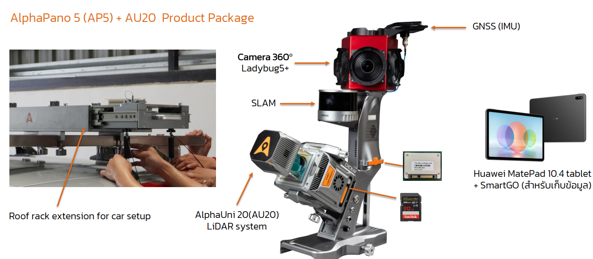

# CHC AlphaUni 20 Introduction

## คำจำกัดความ

<ul>
  <li><strong style="color:#f47b20">AlphaPano 5 Product Package</strong> : แพลตฟอร์ม(Platform) ติดตั้งสำหรับยานพาหนะ</li>
  <li><strong style="color:#f47b20">AU20 LiDAR system</strong> : ระบบ LiDAR ที่ประกอบด้วยเครื่องสแกนเลเซอร์ความแม่นยำสูง และระบบนำทางเชิงมุม ซึ่งมีขนาดกะทัดรัดและน้ำหนักเบา</li>
  <li>สามารถใช้งานได้ในโหมดทางอากาศ (Airborne Mode) โหมดติดตั้งกับยานพาหนะ (Vehicle Mode) และแบบสะพายหลัง (Backpack) 
    โดยมีความสามารถในการเปลี่ยนไปยังแพลตฟอร์มต่าง ๆ เพื่อเก็บข้อมูลได้
  </li>
</ul>

---

## **AlphaPano 5 Product Package**

- AlphaUni 20 LiDAR system  
- Ladybug5+ car kit platform  
- Roof rack extension  
- MathPad tablet  
- Battery & battery charger  
- Wheel encoder accessories  
- Transport container
