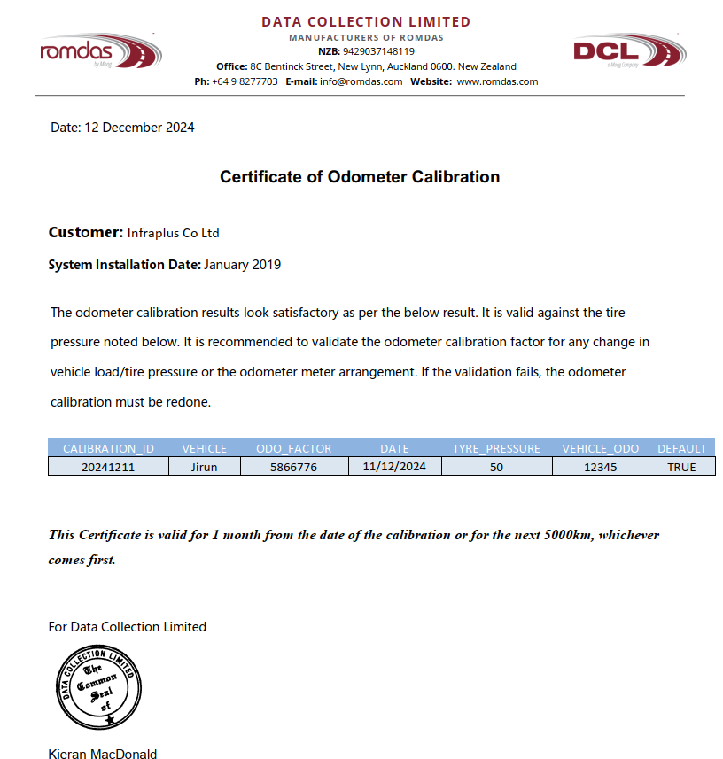

# ใบรับรองการสอบเทียบ   (CERTIFICATE OF ODOMETER CALIBRATION)

---

## 📝 คำอธิบายภาษาไทย:

ใบรับรองนี้มีผลใช้ได้เป็นระยะเวลา 1 เดือน  
นับจากวันที่ทำการสอบเทียบ หรือจนถึง ระยะทาง 5,000 กิโลเมตร แล้วแต่อย่างใดถึงก่อน

หากมีการเปลี่ยนแปลงที่เกี่ยวข้องกับ:

1. **แรงดันลมยาง** (tyre pressure)  
2. **ค่าโหลดของยานพาหนะ** (vehicle load)  
3. **การตั้งค่า ODO meter**

จำเป็นต้องทำการสอบเทียบใหม่

